<a id="top"></a>

<h1 align="center">
  <picture>
    <source media="(prefers-color-scheme: dark)" srcset="./apps/app/assets/brand/clipquest-lockup-on-dark.png" />
    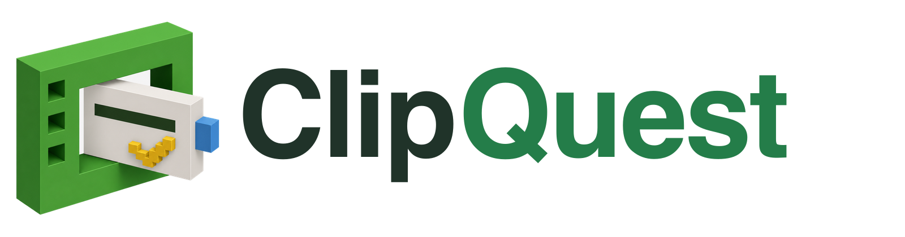
  </picture>
</h1>

<p align="center"><strong>Turn YouTube lessons into real mastery.</strong></p>

<p align="center">
  <strong>Paste a public YouTube lesson, build an evidence-based quiz in your browser, and learn through immediate feedback.</strong>
</p>

<p align="center">
  <a href="https://clipquest.ccwu.cc"><strong>Open ClipQuest →</strong></a>
</p>

<p align="center">
  
  
  
  
  
  
  
  
  
  
  
</p>

<p align="center">
  <a href="#judge-briefing"><strong>Judge briefing</strong></a> ·
  <a href="#overview">Overview</a> ·
  <a href="#release-status">Release status</a> ·
  <a href="#visual-system">Visual system</a> ·
  <a href="#journey">Learning journey</a> ·
  <a href="#screenshots">Screenshots</a> ·
  <a href="#tech-stack">Tech stack</a> ·
  <a href="#architecture">Architecture</a> ·
  <a href="#quick-start">Quick start</a> ·
  <a href="#verification">Verification</a> ·
  <a href="#deploy">Deploy</a> ·
  <a href="#privacy">Privacy</a>
</p>

<p align="center">
  <strong>Project guides:</strong>
  <a href="./docs/README.md">Documentation index</a> ·
  <a href="./docs/PRODUCTION-RELEASE.md">Production release</a> ·
  <a href="./docs/ITERATION-OVERVIEW.pdf">Event iteration overview</a> ·
  <a href="./docs/ADMIN-CONSOLE.md">Operations console</a> ·
  <a href="./docs/QA-HEADLESS-MATRIX-2026-08-22.md">Headless matrix re-run</a> ·
  <a href="./docs/QA-YOUTUBE-BROWSER-10X-2026-08-22.md">Current live QA</a> ·
  <a href="./docs/QA-FIRST-QUESTION-ETA-2026-08-22.md">Progressive generation QA</a> ·
  <a href="./docs/duolingo-ui-research.md">UI research</a>
</p>

<p align="center">
  <a href="https://github.com/404-Waifu-Not-Found/HHCC2026/actions/workflows/ci.yml"></a>
  
</p>

> [!TIP]
> **HHCC 2026 judges — this is your fastest path.** ClipQuest is the **Iteration Track** entry from team
> `@404-Waifu-Not-Found/cos`, submitted under the **Education** theme. The five-minute
> judge brief — the learning problem, how each feature maps to learning science (retrieval
> practice, immediate corrective feedback, adaptive retries, a missed-concept recap,
> spaced review with mastery states, a consolidation cheat sheet), what is verified in
> production, the honest current limitation, and how to try it in two minutes — is in
> **[docs/HACKATHON.md](./docs/HACKATHON.md)**. The [judge briefing](#judge-briefing)
> below maps the repository to the handbook's five scoring dimensions. For the shortest
> visual overview, open the **[seven-page judge PDF](./output/pdf/ClipQuest_Project_Description.pdf)**.
> Everything after it is the full engineering reference.
>
> **Pre-event baseline:** one week before HHCC 2026 this repository contained only a short
> written README describing the product idea. No product flow, frontend, quiz engine,
> persistence layer, browser extension, native client, or deployment existed. Every line of
> product code in this repository was written during the 36-hour challenge.

---

<a id="judge-briefing"></a>

## 🏆 HHCC 2026 judge briefing — score the proof, not the pitch

Use this section as the judging index: start with the live product, verify the learner loop,
then use the linked QA and architecture evidence to test the claims. The project is intentionally
explicit about its current limitation instead of presenting roadmap work as complete.

### Submission at a glance

| Item                | Entry                                                                                                        |
| ------------------- | ------------------------------------------------------------------------------------------------------------ |
| Project name        | **ClipQuest** — turn any public YouTube lesson into an evidence-grounded mastery quest                       |
| Track / theme       | Iteration Track · **Education**                                                                              |
| Team                | `@404-Waifu-Not-Found/cos`                                                                                   |
| Iteration code      | This repository — [github.com/404-Waifu-Not-Found/HHCC2026](https://github.com/404-Waifu-Not-Found/HHCC2026) |
| Iteration overview  | [`docs/ITERATION-OVERVIEW.md`](./docs/ITERATION-OVERVIEW.md) · [PDF](./docs/ITERATION-OVERVIEW.pdf)          |
| Live product        | [clipquest.ccwu.cc](https://clipquest.ccwu.cc) — deployed and reachable during judging                       |
| AI usage disclosure | [Declared below](#ai-usage-disclosure), as required by the handbook's AI Usage Guidelines                    |

### Evidence of improvement — pre-event versus post-event

The Iteration Track scores _clear evidence of improvement from the pre-event version_. This is the
before-and-after in one table; the full stage-by-stage log with the problem each stage solved is in
the [iteration overview](./docs/ITERATION-OVERVIEW.md).

| Area          | Pre-event (one week before) | Post-event (submitted here)                                                                   |
| ------------- | --------------------------- | --------------------------------------------------------------------------------------------- |
| Product state | Short README only           | Deployed web product with a browser-extension bridge and native implementation paths          |
| Input         | Product idea                | Public YouTube URL validation, metadata preview, and caption acquisition                      |
| AI            | No implemented AI flow      | Learner-owned DeepSeek key used locally for structured, schema-validated generation           |
| Learning      | No quiz experience          | Multiple-choice, true/false, and short-answer quizzes with immediate corrective feedback      |
| Progress      | No persistence, no mastery  | Authenticated attempts, ordered storage, mastery ranks, review state, and Library             |
| Reliability   | No validation or recovery   | Contract validation, bounded retries, first-missing-ordinal repair, cancellation, idempotency |
| UX            | No interface                | Responsive UI, light/dark themes, motion, accessibility, and explicit states                  |
| Platforms     | No working client           | Web, Chrome extension bridge, iOS path, and Android path sharing the core engine              |
| Delivery      | No deployment               | Cloudflare Worker plus static assets live at clipquest.ccwu.cc                                |
| Verification  | No test suite               | Automated contract, API, app, engine, extension, UI, build, and asset checks in CI            |

### Where to look for each scoring dimension

| Dimension (Iteration weight)          | What we claim                                                                                                                                                                                                                                                 | Verify here                                                                                                                     |
| ------------------------------------- | ------------------------------------------------------------------------------------------------------------------------------------------------------------------------------------------------------------------------------------------------------------- | ------------------------------------------------------------------------------------------------------------------------------- |
| **Creativity and Originality** (30%)  | The generation boundary sits in the learner's own browser with the learner's own key, so lesson content is grounded in real captions rather than model invention — and the visual system, iconography, and brand object are authored from scratch, not stock. | [Product overview](#overview) · [Original visual system](#visual-system) · [Privacy boundary](#privacy)                         |
| **Technical Complexity** (30%)        | A four-surface system — React 19 web app, Chrome extension, shared local quiz engine, Cloudflare Worker + D1 — joined by typed contracts, a streaming question-at-a-time protocol, strict ordinal validation, and bounded automatic repair.                   | [Architecture and module guide](#architecture) · [Tech stack](#tech-stack) · [`packages/contracts/`](./packages/contracts/)     |
| **Functionality and Usability** (20%) | The live product completes real quests end to end; progressive generation opens the attempt on question 1 instead of making learners wait for a full bank; failures are explicit rather than silently faked.                                                  | [Release status](#release-status) · [Learning journey](#journey) · [Screenshots](#screenshots) · [QA reports](./docs/README.md) |
| **Branding and Social Impact** (10%)  | An original brand system and a zero-server-cost-per-learner model: learners bring their own key, so open educational video becomes practice material without a paywall.                                                                                       | [Original visual system](#visual-system) · [docs/HACKATHON.md](./docs/HACKATHON.md)                                             |
| **Teamwork and Collaboration** (10%)  | Documented role division, technical decisions, and the reasoning behind each iteration stage.                                                                                                                                                                 | [Iteration overview — team decisions](./docs/ITERATION-OVERVIEW.md)                                                             |

### Honest release status

We report what is verified and what is not. Our latest ten-video matrix — re-run against live
captions and the live DeepSeek API — clears progressive entry (10/10 reached question 1), the
storage-only privacy boundary, the no-fallback guarantee, content acceptance (the "According to"
regression fell from 79/100 to 0/80), and deterministic grading (80/80 correct). The one gate still
open is zero-intervention full-bank completion: 5/10 videos completed on the first attempt and 8/10
after one re-attempt, traced to a single identified `question_answer_kind_mismatch` outcome that can
exhaust its bounded retries. Every such case failed closed, preserving the accepted prefix without
substituting invented content, so the safety guarantee held throughout. Full numbers are in the
[current release status](#release-status) and the
[headless matrix report](./docs/QA-HEADLESS-MATRIX-2026-08-22.md), and the run artifacts are
committed so anyone can check them. The in-development Workplace AI chat route stays hidden behind a
release gate rather than being demoed as finished.

<a id="ai-usage-disclosure"></a>

### AI usage disclosure

Per the handbook's AI Usage Guidelines:

- **Tools used:** GitHub Copilot and Claude Code CLI, totalling roughly $240 in API-token usage.
- **Team-owned:** the core product concept and UX flow, feature scope and prioritization, project
  architecture and file structure, the caption-only privacy boundary, the validation/recovery
  algorithms, the mastery and review model, the testing and CI strategy, and the visual direction.
- **AI-assisted only:** boilerplate and repetitive code, syntax lookup and autocomplete, refactoring
  and formatting, documentation drafting, and debugging assistance.
- Every key decision and creative direction was made by the team; AI served as an auxiliary coding
  tool, and the team can explain the principles and implementation of every module.

<p align="right"><a href="#top">↑ Back to top</a></p>

---

<a id="overview"></a>

## 🧭 Product overview

ClipQuest turns public YouTube educational videos into focused learning sessions. A learner pastes a YouTube link, chooses multiple-choice, true/false, and/or short-answer questions, confirms the lesson, and starts a generated quest.

### Community progress features

- **Server-tracked learning time:** each completed video stores a duration snapshot on the server, and profile totals add the duration of each unique completed video.
- **Public profiles:** click any learner in the leaderboard to view their public avatar, completed-quiz count, total learning time, and GitHub-style activity calendar. Private account details remain hidden.
- **Activity calendar:** completion history is shown as a year of daily quiz activity on both personal and public profiles.

On the web, the **ClipQuest Local AI** Chrome extension is the generation boundary. It acquires YouTube captions in the browser, converts timestamped segments into normalized plain text, and sends that text directly to DeepSeek using the learner's own API key. DeepSeek returns streamed JSON in profile-sized sequential calls: the current evidence-grounded profile uses one question per primary call, while isolated compatibility profiles can request small consecutive chunks. As each complete question object closes, the extension validates its expected ordinal, requested type, fields, answer mapping, and duplicate invariants before emitting it to the ClipQuest page.

The Cloudflare Worker does **not** generate quizzes. It authenticates the learner and stores validated singleton questions in strict ordinal order. Question 1 creates a generating bank and a full-length attempt immediately; later questions append while the learner is already answering. The bank becomes passed, reviewable, and Library-eligible only after all 5, 10, or 15 requested questions have been stored.

```text
public YouTube URL
       │
       ▼
ClipQuest page ───── authenticated metadata ────► Cloudflare Worker
       │
       │ extension bridge (no API key)
       ▼
ClipQuest Local AI extension
       │
       ├─► YouTube captions → timestamp-free plain text
       │
       └─► DeepSeek V4 Flash → streamed JSON, sequential profile-sized calls
                              │
                              ▼
                validate each closed question object
                              │
                              ▼
ClipQuest page ───── ordered singleton questions ─────► storage-only append
                                                        │
                         question 1 ─► full-length attempt opens
                         questions 2…N append in background
                                                        │
                                                        ▼
                                      lesson → feedback → mastery
```

> [!IMPORTANT]
> Google or YouTube account access is not required. The web experience requires the unpacked Chrome extension and a learner-supplied DeepSeek API key. It accepts only public YouTube videos with usable text captions and never downloads or transcribes video media. Unsupported sources fail explicitly; ClipQuest does not manufacture fallback questions.

<p align="right"><a href="#top">↑ Back to top</a></p>

<a id="release-status"></a>

## 🚦 Current release status

As of **2026-08-22**, Chrome extension 0.8.32 uses the caption-only local quiz engine. New banks are assigned the non-thinking `stable_non_thinking_v5_2` profile: question 1 is requested and validated first, the attempt opens as soon as that question is stored, and the remaining questions continue in adaptive background batches. A rejected later question preserves the accepted prefix and triggers bounded AI repair for the first missing ordinal; it never creates a learner-facing retry action. The Workplace AI chat route is currently hidden from navigation for all users while it remains in development. The live `/health` response and Wrangler deployment history remain authoritative for [clipquest.ccwu.cc](https://clipquest.ccwu.cc).

- The assigned new-bank contract is result protocol `6`, capability `question-stream-v2`, pipeline `9`, prompt `quiz-local-json-stream-v5.2`, validator `validator-local-progressive-v4.1`, progressive import `v4`, and profile `stable_non_thinking_v5_2`.
- The checked-in rollout enables v5.2 and disables v5.3, v5.4, and v5.9-v5.12. `/api/local-ai/profile` remains authoritative for each authenticated learner.
- Extension `0.8.31` uses the current engine. Existing completed banks retain their original prompt, validator, profile, model, and client-integrity metadata.
- Backend quiz generation is disabled. Web generation requires the Chrome extension.
- No Worker generation Queue binding and no generated-question fallback path.
- The first non-thinking DeepSeek request contains only question 1. Later calls request up to three consecutive questions, or at most two when a short answer is present, while the learner answers the accepted prefix.
- Every completed question object is validated and imported in order. A transport, truncation, schema, ordering, answer-mapping, or duplicate-prompt failure preserves the accepted prefix and automatically regenerates only the first missing ordinal with bounded repair guidance. No generated-looking fallback is allowed.
- Prose short answers use one to three independent required ideas and three to six complete full-credit variants. The deterministic Worker grader preserves its 67% alternative threshold while normalizing pronouns, safe acronyms, and conservative signal-transfer/processing aliases; formula answers retain structural grading.
- The attempt opens after question 1 is stored. If the learner catches the generation frontier, the quiz waits and polls automatically while the existing recovery coordinator continues the missing suffix; there is no manual continuation control.
- Mixed multiple-choice, true/false, and short-answer plans are seeded, balanced, and bounded to avoid runs longer than two where the selection permits it.
- D1 stores the validated learner-visible questions plus privacy-safe call events and short recovery-claim leases. Call telemetry and claims never store generation instructions, captions, raw model output, credentials, or DeepSeek errors.
- Multiple-choice options are securely shuffled before import and shuffled again for each activated learner view; True/False remains True then False.
- Original green-led light and dark themes now cover learner, authentication, quiz, administration, extension, and PWA surfaces.
- A statically bundled voxel icon registry and abstract learning-prism mark replace stock glyphs and the retired human-like mascot.
- Signed-out traffic enters through `/sign-in`; account-free product exploration remains available from the sign-up screen through `/welcome`.

The live `/health` response and Wrangler deployment history are the authoritative production checks. Health exposes the model and pipeline versions plus `backendQuizGeneration`, `extensionQuizGeneration`, and `extensionRequired` readiness flags without exposing secrets or relying on a stale version number in this document.

### Headless generation matrix re-run — 2026-08-22 (current)

Re-run with the headless QA harness (`npm run qa:quiz`) against real public YouTube captions and the live DeepSeek API, ten videos at ten questions each, all three question types, with reference-answer grading enabled. This run exercised the prompt-first `prompt_first_auto_v5_12` profile (prompt `quiz-local-json-stream-v5.12`, validator `validator-minimal-gradeability-v5.3`, import `extension-progressive-import-v8`, protocol `10`, pipeline `9`, model `deepseek-v4-flash`).

- Progressive entry reached question 1 on **10/10** videos; median time to question 1 was 19.9 s (mean 22.0 s, max 41.8 s).
- Complete ten-question banks: **5/10 on the first attempt, 8/10 after one re-attempt.** 80 questions were stored across the complete banks using 80 model calls and 13 automatic bounded retries.
- **Zero fallback or invented questions were emitted.** All 80 stored prompts were unique, and `production_validator`, `exact_duplicate`, `fragmentary_prompt`, and `answer_prompt_consistency` each passed 80/80. `absolute_wording` returned 76 PASS and 4 NOTICE.
- **Content acceptance now passes.** Prompts containing “According to” fell from 79/100 to **0/80**, “According to the lesson” from 26/100 to **0/80**, and the display-time prefix sanitizer corrupted no prompts.
- Deterministic grading returned **80/80 correct** on reference answers.
- The one gate still open is zero-intervention full-bank completion, and it traces to a single identified outcome: `question_answer_kind_mismatch` on one ordinal exhausting its three bounded structural retries. The engine failed closed every time, preserving the accepted prefix without substituting content. Re-running the five recovered three, so the behaviour is probabilistic rather than inherent to those lessons; `qP-9wwRrJbg` and `G8zkXA5TXgg` reproduce it reliably and serve as the regression tests.

The re-run therefore **clears** progressive entry, the storage-only privacy boundary, the no-fallback guarantee, content acceptance, and deterministic grading. Full write-up and artifacts: [headless matrix report](./docs/QA-HEADLESS-MATRIX-2026-08-22.md) and `output/headless/matrix-2026-08-22/`. The harness is reproducible with `npm run qa:quiz`.

### Previous production snapshot — 2026-08-22 (superseded)

- Active Worker version: `a8d8cda5-ea66-4e87-afae-388b2cf237dd`, tagged from Git SHA `9c1bc3b75929819cc18f1a7bb4a50b7cd954dc03`.
- Latest applied D1 migration: `0019_grounded_generation_telemetry.sql`.
- Chrome exposed ClipQuest Local AI `0.8.5`; `/health` advertised pipeline `9`, prompt v5.5, validator v4.4, extension-local generation, and no backend generator.
- All generation rollout variables were disabled. The ten newly created banks therefore persisted `legacy_reasoning_v5_1` and prompt v5.1 despite the current metadata advertised by `/health`.
- Ten different videos ultimately produced ten complete banks; all 100 planned questions were answered through the visible learner flow. The completed banks used 53 planned model calls with zero recorded retries or non-complete outcomes.
- First-attempt completion was only 9/10. One excluded 15-question attempt stopped at 11/15 after two schema-invalid calls; its automatic recovery was incorrectly recorded as a legacy `manual_continuation`, and a fresh quiz was required.
- Content acceptance failed: 26/100 stored prompts used the exact phrase “According to the lesson,” 79/100 included “According to,” and a display-time prefix sanitizer visibly corrupted at least five prompts. **This regression is resolved by the current matrix above.**

That earlier matrix verified progressive entry, full-length completion after restart, storage-only privacy, and authoritative call accounting, but did not clear the evidence-grounded rollout or zero-intervention release gate. See also the [browser QA report](./docs/QA-YOUTUBE-BROWSER-10X-2026-08-22.md).

The 2026-08-22 source gate passed **138 unit, contract, API, app, and extension tests** plus **21 Playwright Chrome journeys**, repository-wide TypeScript and ESLint checks, the web build, extension packaging, Worker bundling, and a Wrangler dry run. This is historical automated evidence, not a substitute for the current production matrix.

The current source gate continues to require progressive generation checks, bounded recovery, and exact question ordering before any new generation profile is enabled. See the [progressive generation QA report](./docs/QA-FIRST-QUESTION-ETA-2026-08-22.md).

Workplace AI chat is currently hidden from the navigation and redirects to Library for every user while the feature remains in development. Its source remains available behind the shared release gate for future re-enablement.

Before enabling the current prompt-first v5.12 profile, deploy one immutable extension-0.8.19 candidate with `QUIZ_V5_12_ROLLOUT` disabled, install its matching ZIP, complete the recorded and direct benchmarks, assign the `unoxyrich` canary, and rerun the ten-video matrix against the v5.12 profile. Separate remaining acceptance still includes captionless local transcription on supported web hardware and Resend delivery.

<p align="right"><a href="#top">↑ Back to top</a></p>

<a id="visual-system"></a>

## 🎨 Original visual system

ClipQuest's interface takes product-craft cues from polished learning software—focused tasks, visible progress, large controls, tactile depth, immediate feedback, and generous whitespace—while using independently authored colors, geometry, components, and artwork. The [design research and adaptation boundary](./docs/duolingo-ui-research.md) explicitly excludes Duolingo assets, Feather Green, characters, proprietary fonts, sounds, copy, and traced illustrations.

| System element    | ClipQuest implementation                                                                                                      |
| ----------------- | ----------------------------------------------------------------------------------------------------------------------------- |
| Brand anchor      | Structural green `#247D49` with action green `#54C878`; neither reproduces Duolingo's palette                                 |
| Themes            | Equally supported light and deep-green dark themes with semantic blue, warning, and error roles                               |
| Brand object      | A non-anthropomorphic learning prism made from an interlocking video frame, quiz card, knowledge marker, and companion block  |
| Primary lockup    | The learning prism paired with a custom-cased Fredoka `ClipQuest` wordmark; constrained launcher icons retain the prism alone |
| Iconography       | Individually generated, transparent, low-density isometric voxel PNGs resolved through a typed static registry                |
| Typography        | Fredoka for short display copy and DM Sans for body/interface copy, with existing language fallbacks unchanged                |
| Interaction       | 44 px minimum targets, 16–24 px radii, visible keyboard focus, semantic feedback, and reduced-motion support                  |
| Platform identity | Deterministic derivatives for favicon, PWA, and browser-extension artwork                                                     |

The learning prism has no face, body, limbs, clothing, pose, mood, or character reactions. Processing, success, and error states are communicated by status copy, semantic panels, and progress—not mascot behavior.

<p align="center">
  <picture>
    <source media="(prefers-color-scheme: dark)" srcset="./apps/app/assets/brand/clipquest-lockup-on-dark.png" />
    
  </picture>
</p>

<p align="right"><a href="#top">↑ Back to top</a></p>

<a id="journey"></a>

## 🗺️ Learning journey

### 1. Install Local AI once

ClipQuest detects the extension before allowing the web flow to continue. If it is missing, the site downloads `clipquest-captions-extension.zip` and shows the three unpacked-extension installation steps. The extension popup stores the learner's DeepSeek key in `chrome.storage.local` and can test or remove it at any time.

### 2. Paste and preview

The YouTube URL field is the primary action on the web. The extension also embeds an **Open in ClipQuest** action beside YouTube's watch-page controls; it opens ClipQuest with that video's normalized URL already filled in. ClipQuest validates official YouTube hosts and common URL forms, then presents the available title, channel, duration, language, and thumbnail before generation begins.

### 3. Acquire captions as plain text

For YouTube, the extension reads public caption data, keeps the complete ordered segment set, removes timestamps, joins rolling auto-caption fragments, and produces clean plain text. The toolbar popup is intentionally limited to DeepSeek key configuration; caption acquisition and quiz generation begin from ClipQuest. If complete usable captions are unavailable, generation stops before DeepSeek is called. ClipQuest does not download, decode, or transcribe video audio.

### 4. Generate question 1, then continue locally

The client sends the complete caption text directly to DeepSeek V4 Flash with thinking disabled, temperature `0.2`, JSON-object response mode, and a seeded type plan. Extension 0.8.31 requests question 1 alone, validates it, and exposes it to the upload queue immediately. Later calls request small consecutive batches in the background. Each completed object is validated independently, so a bad q9 cannot erase q1–q8. The engine automatically asks DeepSeek to replace the first missing ordinal with the exact validation reason and bounded backoff; it never substitutes fallback content.

### 5. Import, answer, and save

The page sends each validated question—not the transcript, raw DeepSeek response, or learner's key—to the authenticated import endpoints. The first stored question creates a pipeline-9 generating bank, ordered appends reconcile the remaining items, and skipped or conflicting ordinals fail closed. Existing passed banks remain readable, while incomplete banks stay out of Library selection and review mode.

### 6. Open on question 1 and recover invisibly

The generation screen uses one fixed-duration, time-linear clock for time to question 1; caption metadata and internal stages cannot reset it or change its speed. The learner enters the quiz route as soon as question 1 is authoritative. Model and schema failures are repaired in the background, and transient attempt-resume failures keep polling with bounded backoff. Invalid credentials or billing still expose local-AI configuration because the model cannot repair account access.

### 7. Share the quest

The completion screen and every Library card offer **Share this quest**. ClipQuest mints one stable link per bank (`https://clipquest.ccwu.cc/s/<token>`), copies it to the clipboard on desktop web and opens the share sheet on touch devices. The link renders a public preview—lesson title, concept names, question count and types, never the questions or answers—and a signed-in recipient gets their own copy of the validated bank with the complete feedback, recap, mastery and cheat-sheet loop. Links require no extension to play.

<p align="right"><a href="#top">↑ Back to top</a></p>

<a id="screenshots"></a>

## 🖼️ Product screenshots

### Current production captures — 2026-08-22

These captures show the current deployed library and leaderboard surfaces, including progress cards, learner avatars, and community ranking.

| Library                                                                                  | Leaderboard                                                                                      |
| ---------------------------------------------------------------------------------------- | ------------------------------------------------------------------------------------------------ |
| 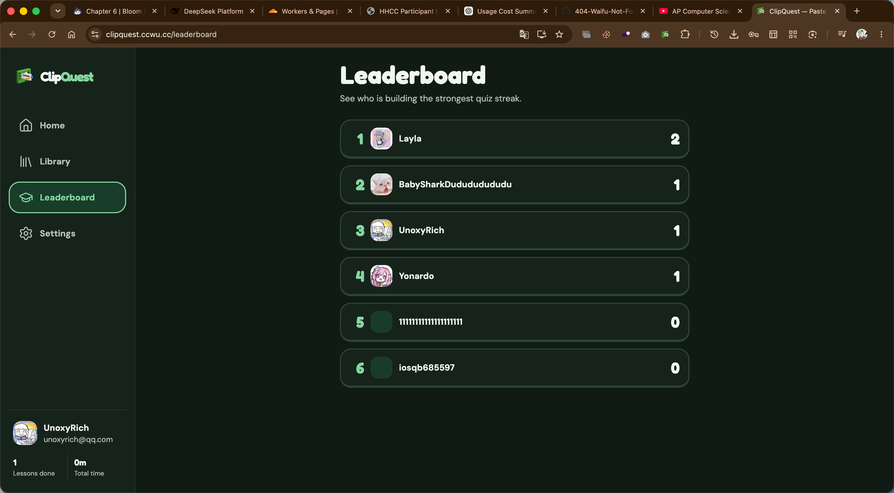 | 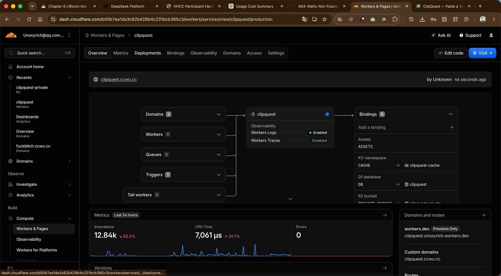 |

### Link-first home

The YouTube-link field remains immediately visible and visually dominant. Saved ClipQuest lessons appear below it without turning the product into a video feed or account dashboard.

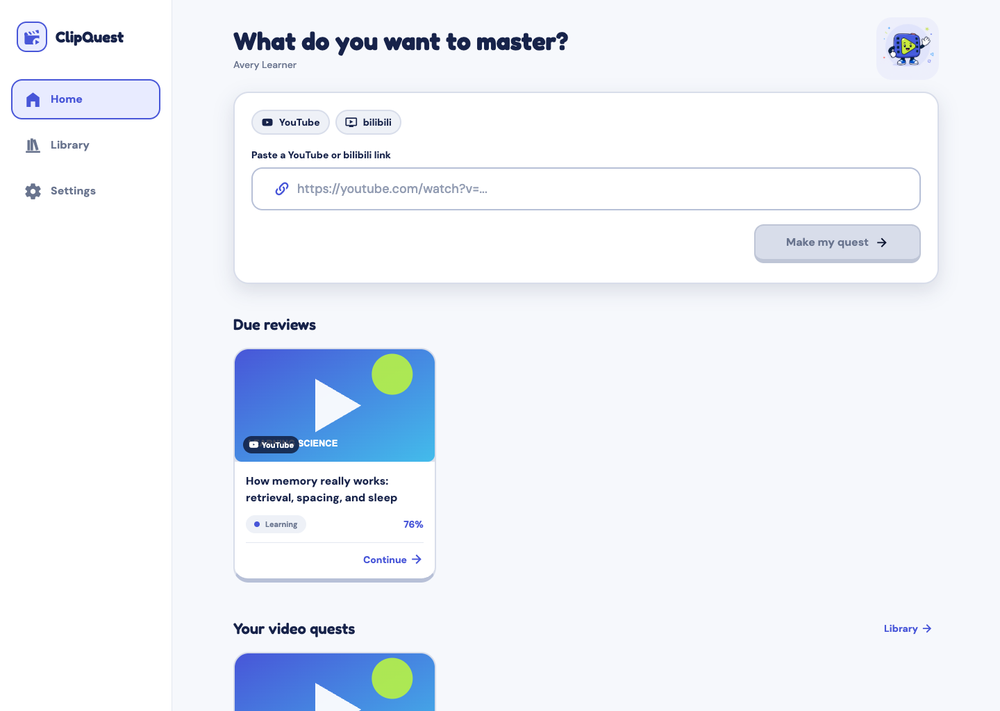

### Video detection and processing

| Detected video preview                                                                  | Generation timeline                                                             |
| --------------------------------------------------------------------------------------- | ------------------------------------------------------------------------------- |
| 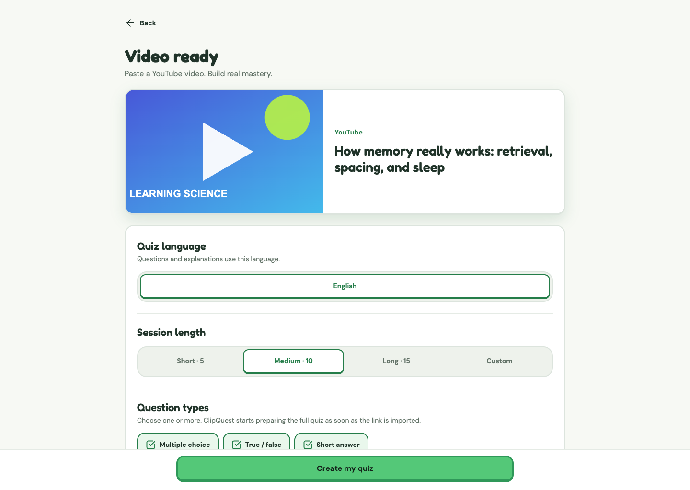 | 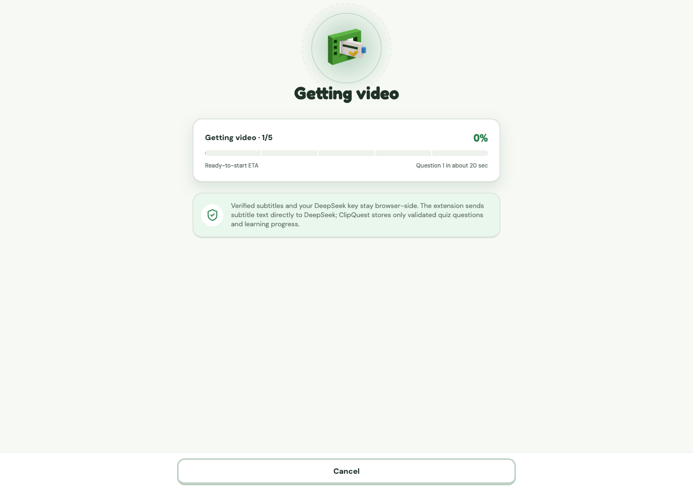 |

### Generated learning experience

The same green hierarchy, voxel vocabulary, progress treatment, and tactile answer states carry throughout the web learning flow.

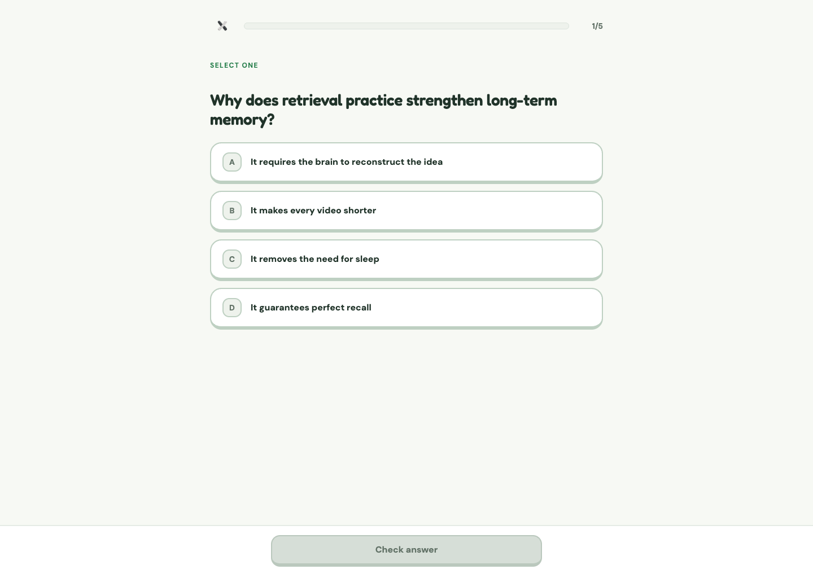

### Lesson feedback

The lesson keeps the question readable while the lower action region changes state. Icons and text reinforce color so the result is understandable without relying on green or red alone.

| Correct answer                                                                              | Incorrect answer                                                                                |
| ------------------------------------------------------------------------------------------- | ----------------------------------------------------------------------------------------------- |
| 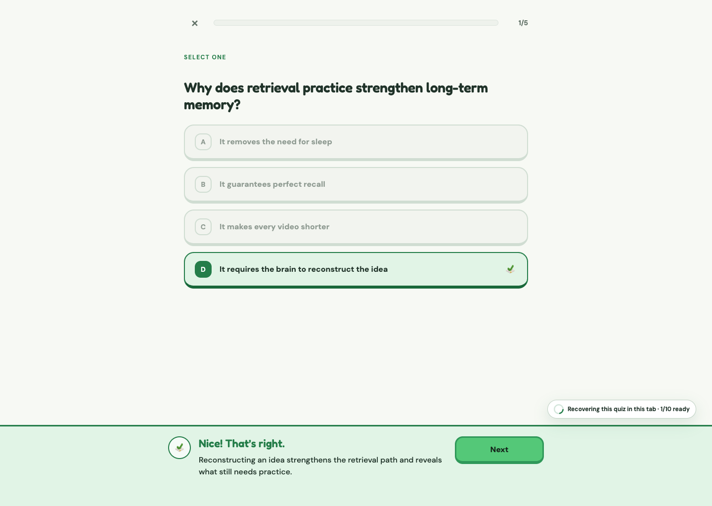 | 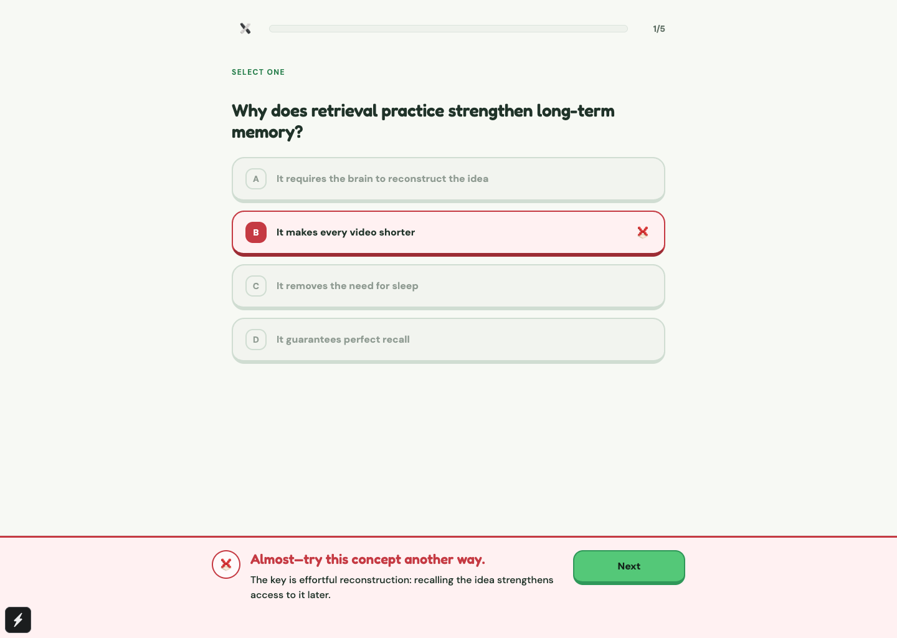 |

### Completion recap — what to review

The completion screen pairs the score and mastery state with a "Right first try" count and a **What to review** list: every question missed during the session, the learner's answer, the correct answer, the reasoning, and whether the concept was recovered on its adaptive retry. Reopened historical attempts show the summary tiles only.

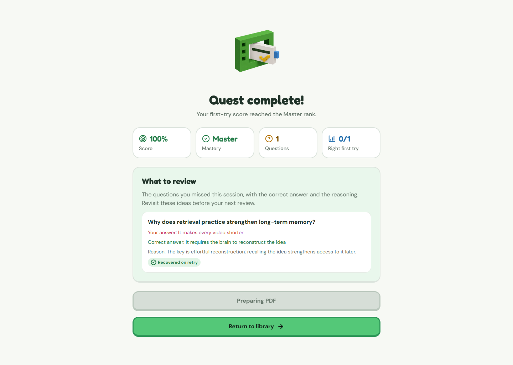

### Leaderboard and public profiles

Leaderboard entries are interactive. Selecting a learner opens a read-only public profile with their avatar, completed quizzes, total learning time, and daily activity history.

| Library progress cards                                                                          | Leaderboard                                                                                                                |
| ----------------------------------------------------------------------------------------------- | -------------------------------------------------------------------------------------------------------------------------- |
|  |  |

### Private operations

The role-gated operations console uses the same semantic colors and voxel vocabulary while retaining denser tables and controls for system work.

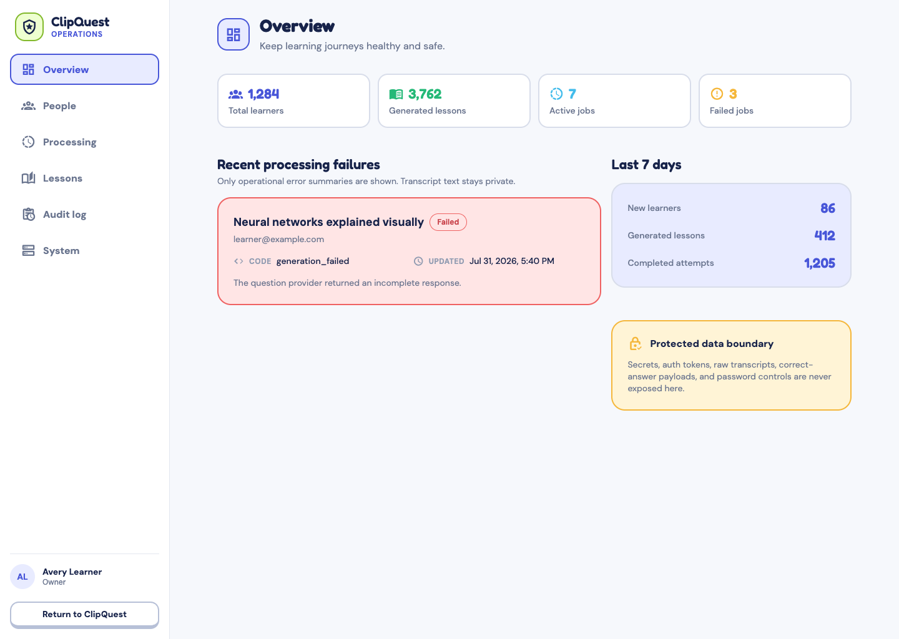

<p align="right"><a href="#top">↑ Back to top</a></p>

<a id="tech-stack"></a>

## 🧩 Tech stack and repository languages

The language inventory below comes from the tracked repository and the web application.

| Language or format                 | Where ClipQuest uses it                                                                                                                                                          |
| ---------------------------------- | -------------------------------------------------------------------------------------------------------------------------------------------------------------------------------- |
| TypeScript and TSX                 | Web routes and components, Cloudflare Worker API, shared Zod contracts, Playwright, tests, and build configuration                                                               |
| JavaScript and ESM (`.js`, `.mjs`) | Manifest V3 extension runtime, caption processing, local quiz generation, web workers, asset scripts, and packaging                                                              |
| React ecosystem                    | React 19 and React DOM power the web product interface                                                                                                                           |
| SQL                                | Twenty-six ordered D1 migrations for authentication, quiz storage, reliability, administration, progressive imports, safe call telemetry, recovery claims, and profile analytics |
| HTML                               | Extension popup markup and the checked-in local extension QA harness                                                                                                             |
| CSS                                | Extension popup presentation and interaction states                                                                                                                              |
| JSON and JSONC                     | Package manifests, extension manifest, QA summaries, and Wrangler configuration                                                                                                  |
| Markdown                           | Product, operations, design-research, platform-asset, and deployment documentation                                                                                               |
| Web App Manifest                   | Installable PWA identity, icons, theme colors, and launch behavior                                                                                                               |
| WebVTT and plain text              | Non-secret caption QA fixtures and normalized-caption acceptance artifacts                                                                                                       |

The primary product runtime is TypeScript/React, the browser extension is JavaScript/HTML/CSS, and the edge and data layer is TypeScript/SQL on Cloudflare.

<p align="right"><a href="#top">↑ Back to top</a></p>

<a id="architecture"></a>

## 🔗 Architecture and module guide

| Layer                | Technology                                                       | Responsibility                                                                                                                      |
| -------------------- | ---------------------------------------------------------------- | ----------------------------------------------------------------------------------------------------------------------------------- |
| Web app              | React 19, React DOM                                              | Authentication, paste/import, lessons, feedback, mastery, administration, and themes                                                |
| Browser extension    | Chrome Manifest V3, JavaScript                                   | Web caption access, local streamed DeepSeek generation, retries, and canonical option randomization                                 |
| Edge API             | Cloudflare Workers, Hono, scheduled triggers                     | Better Auth, ordered storage-only question imports, grading, availability, review scheduling, and static assets                     |
| Data and assets      | D1, KV, private R2                                               | Accounts, videos, generating/passed banks, attempts, mastery, profile analytics, rate limits, thumbnails, avatars, and private PDFs |
| Local quiz engine    | Shared JavaScript, DeepSeek V4 Flash                             | Progressive prompts, per-question validation, automatic repair, shuffling, and serialization                                        |
| Caption acquisition  | YouTube public caption tracks                                    | Caption-only source text; missing or incomplete captions fail before generation                                                     |
| Shared contracts     | TypeScript, Zod                                                  | Versioned page protocol, quiz schemas, API requests, and server validation                                                          |
| Quality and delivery | Vitest, Node test runner, Playwright, ESLint, Prettier, Wrangler | Contract tests, browser journeys, static checks, builds, and deployment                                                             |
| Visual identity      | Semantic tokens, typed voxel registry, Sharp                     | Shared light/dark themes and deterministic web and extension assets                                                                 |

### [Web application](./apps/app/)

The user-facing web application owns authentication, home, library, settings, video setup, generation, lesson, completion, and not-found routes. The web build also packages the extension zip into its public output.

Best starting points: [routes](./apps/app/app/) · [components](./apps/app/src/components/) · [local generation adapters](./apps/app/src/generation/) · [theme tokens](./apps/app/src/theme/tokens.ts)

### [Chrome extension](./apps/extension/)

The local caption and quiz engine. The background service worker coordinates YouTube tabs, the ClipQuest page bridge, question-first DeepSeek calls, incremental validation, bounded AI repair, downloads, cancellation, and progress. Legacy continuation metadata remains readable for older banks, but the current learner flow has no continuation button. The API key never enters the page bridge.

Best starting points: [local generator](./apps/extension/src/local-generator.js) · [caption text normalization](./apps/extension/src/caption-text.js) · [background worker](./apps/extension/src/background.js) · [manifest](./apps/extension/manifest.json)

### [Shared local quiz engine](./packages/local-quiz-engine/)

The local generation core consumed by Chrome. Browser storage and tab/port transports remain injected adapters. The package owns no credentials and has no Worker dependency.

### [Cloudflare Worker API](./apps/api/)

The authenticated server boundary. Quiz generation is intentionally absent. `/api/quiz-imports/progressive` stores a locally validated pipeline-9 bank in order, safe call-event writes make request totals authoritative, and attempt-generation status exposes authoritative counts without exposing captions or model output. Existing passed banks remain compatible.

Best starting points: [quiz import route](./apps/api/src/routes/quiz-imports.ts) · [Worker source](./apps/api/src/) · [Wrangler configuration](./apps/api/wrangler.jsonc) · [migrations](./apps/api/migrations/)

### [Shared contracts](./packages/contracts/)

The authoritative Zod schemas and version constants shared by the app and Worker. Change the local-quiz protocol or question union here before updating either consumer.

### [Private operations console](./docs/ADMIN-CONSOLE.md)

Authorized operators use `/admin` to inspect system health, accounts, sessions, read-only generation streams, lessons, and audit history. Roles are server-owned and every management API is permission checked.

## Repository structure

```text
ClipQuest/
├─ apps/
│  ├─ app/                     # Web client and static export
│  ├─ extension/               # Manifest V3 captions and local-AI extension
│  └─ api/                     # Cloudflare Worker, bindings, and migrations
├─ packages/
│  ├─ contracts/               # Shared Zod API and quiz schemas
│  └─ local-quiz-engine/       # Chrome prompt, parser, validation, retry core
└─ docs/                       # Product guides, QA notes, and screenshots
```

<p align="right"><a href="#top">↑ Back to top</a></p>

<a id="quick-start"></a>

## 🚀 Quick start

Recommended: Node.js 22+, npm 10+, Chrome, and a DeepSeek API key owned by the local tester.

```bash
git clone https://github.com/UnoxyRich/ClipQuest.git
cd ClipQuest
npm ci
cp .dev.vars.example apps/api/.dev.vars
npm run db:migrate:local
```

Start the API and web client in separate terminals:

```bash
npm run dev:api
```

```bash
npm run dev:web
```

Open the URL shown in the web terminal. Unauthenticated visits start at `/sign-in`; choose **Create account**, or follow the trial link on the sign-up screen to open `/welcome` and try the YouTube flow without making an account first.

### Build and load the extension

`npm run dev:web` and the production app build package the extension automatically. To build it directly:

```bash
npm run build -w @clipquest/extension
```

Then:

1. Open `chrome://extensions`.
2. Enable **Developer mode**.
3. Choose **Load unpacked**.
4. Select `apps/extension/dist/clipquest-captions-extension`.
5. Pin **ClipQuest Local AI**, open its popup, enter the DeepSeek key, and choose **Save & test**.
6. Reload the ClipQuest page and choose **Check again** if the install gate is still open.

The distributable archive is written to `apps/extension/dist/clipquest-captions-extension.zip`, copied to the tracked release asset at `apps/app/public/clipquest-captions-extension.zip`, and served by the built website at `/clipquest-captions-extension.zip`. The tracked archive ensures the current unpacked-extension package is present in a fresh checkout as well as in the deployed Worker assets.

### Local Worker variables

Use placeholder credentials for presentation-only UI work. Real server integrations use these values in `apps/api/.dev.vars`:

| Variable                             | Purpose                                                                                                                           |
| ------------------------------------ | --------------------------------------------------------------------------------------------------------------------------------- |
| `DEEPSEEK_API_KEY`                   | Legacy pipeline-7 short-answer grading and the disabled experimental history classifier; **not pipeline-9 generation or grading** |
| `RESEND_API_KEY`                     | Verification and password-recovery email                                                                                          |
| `BETTER_AUTH_SECRET`                 | Better Auth signing and session security                                                                                          |
| `YOUTUBE_CREDENTIALS_ENCRYPTION_KEY` | Encryption for the disabled experimental YouTube device flow                                                                      |

> [!WARNING]
> The quiz-generation key is entered only in the extension popup. Never put it in page storage, bridge messages, screenshots, logs, issues, or commits. Local `.dev.vars` and production Worker secrets are separate.

<p align="right"><a href="#top">↑ Back to top</a></p>

<a id="verification"></a>

## 🛠️ Verification and builds

Run the repository quality gate:

```bash
npm run format:check
npm run lint
npm run typecheck
npm test
npm run build
npm run cf:types
npm run cf:dry-run
```

The suite covers caption parsing and timestamp removal, one-character SSE/JSON fragmentation, early question emission, resumable suffix generation, retry budgets, the versioned extension channel, mixed question types, true/false balance, two-stage multiple-choice randomization, ordered/idempotent singleton imports, generating-attempt races, waiting and automatic-recovery states, legacy pipeline compatibility, learner feedback, the completion recap, completion flows, and quest sharing (link creation, the public preview, and copy-on-claim).

The same format, lint, typecheck, unit, and extension-packaging steps run on every pull request and every push to `main` in [GitHub Actions](./.github/workflows/ci.yml). The repository forces LF line endings through `.gitattributes`, and the extension packager falls back to a built-in ZIP writer when the `zip` CLI is missing, so the gate behaves identically on macOS, Linux, and Windows. Two notes for Windows contributors: a clone made before the LF policy keeps its CRLF files until you run `git config core.autocrlf false && git rm -r --cached -q . && git reset --hard` from a clean tree; and when the built-in ZIP writer is used, `npm run dev:web`/`build` leave the tracked release archive `apps/app/public/clipquest-captions-extension.zip` untouched (Chrome loads the unpacked `apps/extension/dist` folder), so only machines with the `zip` CLI refresh that asset.

For a real extension smoke test with Chrome available:

```bash
npm run test:live -w @clipquest/extension
```

Automated tests do not replace live acceptance. Reload the unpacked extension after every extension build, use a fresh public educational video, confirm caption acquisition and the local DeepSeek request, inspect the generated questions, answer **every** question, and reach the completion screen.

<p align="right"><a href="#top">↑ Back to top</a></p>

<a id="deploy"></a>

## ☁️ Cloudflare deployment

The checked-in Wrangler configuration targets [clipquest.ccwu.cc](https://clipquest.ccwu.cc) and binds D1, KV, private R2, an hourly scheduled trigger, and static assets. It has no quiz-generation Queue producer or consumer.

Authenticate and set the Worker-only production secrets from the API workspace:

```bash
cd apps/api
npx wrangler login
npx wrangler whoami
npx wrangler secret put DEEPSEEK_API_KEY
npx wrangler secret put RESEND_API_KEY
npx wrangler secret put BETTER_AUTH_SECRET
npx wrangler secret put YOUTUBE_CREDENTIALS_ENCRYPTION_KEY
cd ../..
```

Apply migrations, build the extension/app/Worker bundle, and deploy:

```bash
npm run db:migrate:remote
npm run build
npm run cf:deploy
```

`npm run cf:deploy` is the guarded versioned rollout described in the [production release guide](./docs/PRODUCTION-RELEASE.md); do not replace it with a direct one-step production deploy.

Verify the active release after deployment:

```bash
curl -fsS https://clipquest.ccwu.cc/health
cd apps/api && npx wrangler deployments status
```

After this source revision is deployed, expected health invariants include pipeline `9`, `backendQuizGeneration: false`, `extensionQuizGeneration: true`, `extensionRequired: true`, and `maintenance: false`. Check the live response before claiming production is current. Then create one disposable quiz and inspect its stored generation profile and prompt version: `/health` reports the deployed code's current capability, while rollout configuration can intentionally select an older profile for new banks. The app and Worker share one deployment, so always build before deploying; otherwise the Worker may serve stale static assets or an old extension archive.

<p align="right"><a href="#top">↑ Back to top</a></p>

<a id="privacy"></a>

## 🛡️ Privacy and security boundary

- The learner's DeepSeek key is stored only in `chrome.storage.local` and is sent only to `https://api.deepseek.com`; ClipQuest's page and Worker never receive it.
- Caption segments and normalized text remain inside the local Chrome generation client. Import receives only video/session settings, verified aggregate source metadata, bounded generation metadata, and locally validated questions. The API key, caption text, prompt, and model body never enter ClipQuest storage or protocols.
- Current generation uses result protocol `10`, client metadata, request IDs, exact-origin boundaries, payload bounds, cancellation, and timeouts. The API key is never part of any ClipQuest protocol.
- The Worker performs no backend quiz generation and returns no generated-looking fallback questions. Invalid, incomplete, wrong-type, or malformed extension output fails closed.
- Multiple-choice option order is securely randomized before import, then randomized again whenever a learner view is activated. Display indexes map back to canonical indexes before submission; True/False order is unchanged.
- D1 queries and R2/KV objects are scoped to authenticated users. Progressive imports require ownership, a UUID idempotency key, rate limits, strict pipeline metadata, and an exact next ordinal. Generating banks cannot enter Library review or complete an attempt early.
- Short answers are graded deterministically by the authenticated Worker from the bounded stored rubric, without sending the learner response or transcript to a model. Answer writes and mastery updates are guarded by the active grading reservation, and automatic generation appends require a live owner lease.
- Operations roles are stored server-side. Privileged changes require authorization and write audit records; generic Better Auth admin endpoints are blocked.
- YouTube OAuth, watch-history imports, subscriptions, playlists, liked videos, and personalized feeds are outside the core flow and disabled by default.
- The web client supports only public videos with usable text captions. Missing captions are rejected before DeepSeek can run; it never downloads or transcribes video audio.
- Do not commit `.env`, `.dev.vars`, API keys, credentials, private transcripts, model caches, exported quiz answers, or QA-user secrets.

> [!WARNING]
> Playwright journeys use contract-shaped mocked API and extension responses. A green UI suite is not proof of live YouTube caption access, DeepSeek availability, Chrome extension freshness, or a completed learner flow.

<p align="right"><a href="#top">↑ Back to top</a></p>

## License

ClipQuest is available under the [Apache License 2.0](./LICENSE).

<p align="right"><a href="#top">↑ Back to top</a></p>
