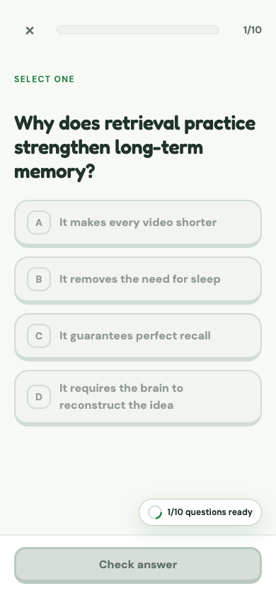
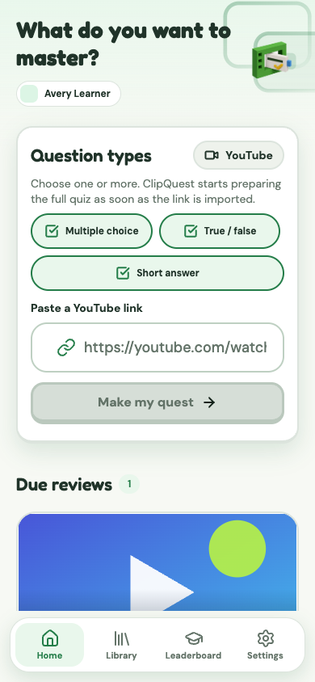
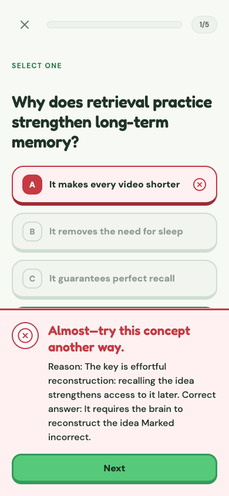
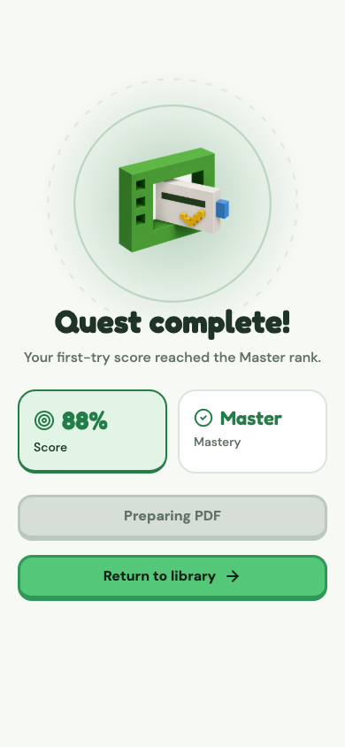
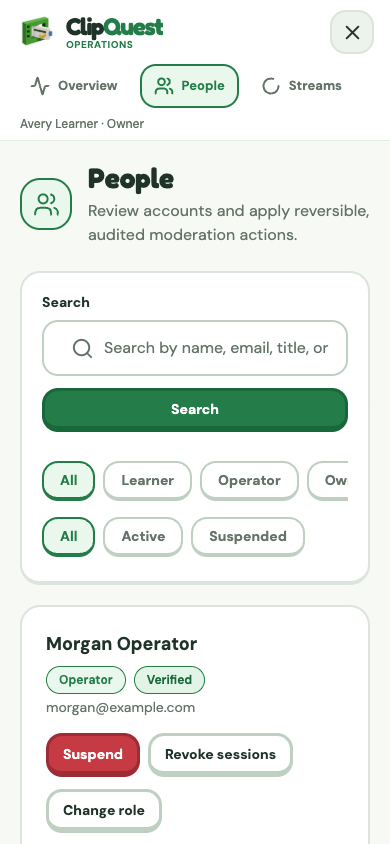

<a id="top"></a>

<h1 align="center">
  <picture>
    <source media="(prefers-color-scheme: dark)" srcset="./apps/app/assets/brand/clipquest-lockup-on-dark.png" />
    
  </picture>
</h1>

<p align="center"><strong>Turn YouTube lessons into real mastery.</strong></p>

<p align="center">
  <strong>Paste a public YouTube lesson, build an evidence-based quiz in your browser, and learn through immediate feedback.</strong>
</p>

<p align="center">
  <a href="https://clipquest.ccwu.cc"><strong>Open ClipQuest →</strong></a>
</p>

<p align="center">
  
  
  
  
  
  
  
  
  
  
  
</p>

<p align="center">
  <a href="#overview">Overview</a> ·
  <a href="#release-status">Release status</a> ·
  <a href="#visual-system">Visual system</a> ·
  <a href="#journey">Learning journey</a> ·
  <a href="#screenshots">Screenshots</a> ·
  <a href="#tech-stack">Tech stack</a> ·
  <a href="#architecture">Architecture</a> ·
  <a href="#quick-start">Quick start</a> ·
  <a href="#verification">Verification</a> ·
  <a href="#deploy">Deploy</a> ·
  <a href="#privacy">Privacy</a>
</p>

<p align="center">
  <strong>Project guides:</strong>
  <a href="./docs/ADMIN-CONSOLE.md">Operations console</a> ·
  <a href="./docs/duolingo-ui-research.md">UI research</a> ·
  <a href="./docs/QA-YOUTUBE-BROWSER-10X-2026-08-03.md">Dated browser QA</a>
</p>

---

<a id="overview"></a>

## 🧭 Product overview

ClipQuest turns public YouTube educational videos into focused learning sessions. A learner pastes a YouTube link, chooses multiple-choice, true/false, and/or short-answer questions, confirms the lesson, and starts a generated quest.

On the web, the **ClipQuest Local AI** Chrome extension is the generation boundary. It acquires YouTube captions in the browser, converts timestamped segments into normalized plain text, and sends that text directly to DeepSeek using the learner's own API key. DeepSeek returns the complete quiz in one required tool call. The extension strictly validates the whole result, randomizes multiple-choice option order, and returns only the completed quiz to the ClipQuest page.

The Cloudflare Worker does **not** generate quizzes. It authenticates the learner, validates the extension result against the shared schema, and atomically stores only a passed quiz so attempts, feedback, mastery, and review can work across sessions.

```text
public YouTube URL
       │
       ▼
ClipQuest page ───── authenticated metadata ────► Cloudflare Worker
       │
       │ extension bridge (no API key)
       ▼
ClipQuest Local AI extension
       │
       ├─► YouTube captions → timestamp-free plain text
       │
       └─► DeepSeek V4 Flash → one complete quiz tool call
                              │
                              ▼
                strict validation + option shuffle
                              │
                              ▼
ClipQuest page ───── completed quiz only ───────► storage-only import
                                                        │
                                                        ▼
                                      lesson → feedback → mastery
```

> [!IMPORTANT]
> Google or YouTube account access is not required. The web experience does require the unpacked Chrome extension and a learner-supplied DeepSeek API key. Private, deleted, geo-restricted, active-live, captionless-without-a-working-local-transcription-path, and otherwise unplayable YouTube videos fail explicitly; ClipQuest does not manufacture fallback questions.

<p align="right"><a href="#top">↑ Back to top</a></p>

<a id="release-status"></a>

## 🚦 Current release status

As of **2026-08-06**, `main` and [clipquest.ccwu.cc](https://clipquest.ccwu.cc) run the extension-local quiz pipeline:

- Pipeline `7`, model `deepseek-v4-flash`, reasoning effort `high`.
- Prompt `quiz-local-tool-v2.0` and validator `validator-local-tool-v2.0`.
- Backend quiz generation disabled; extension generation required.
- No Worker generation Queue binding and no generated-question fallback path.
- Five, ten, or fifteen questions generated together in one DeepSeek tool call.
- Mixed multiple-choice, true/false, and short-answer plans follow the learner's selection.
- Multiple-choice options are shuffled locally with balanced answer positions before import.
- Original green-led light and dark themes now cover learner, authentication, quiz, administration, extension, PWA, and native identity surfaces.
- A statically bundled voxel icon registry and abstract learning-prism mark replace stock glyphs and the retired human-like mascot.
- Signed-out traffic enters through `/sign-in`; account-free product exploration remains available from the sign-up screen through `/welcome`.

The live `/health` response and Wrangler deployment history are the authoritative production checks. Health exposes the model and pipeline versions plus `backendQuizGeneration`, `extensionQuizGeneration`, and `extensionRequired` readiness flags without exposing secrets or relying on a stale version number in this document.

The 2026-08-06 release gate passes **78 unit, contract, and extension tests** plus **12 Playwright journeys**, repository-wide TypeScript, ESLint, and Prettier checks, the Expo static export, extension packaging, Worker bundling, asset validation, and a Wrangler dry run.

Remaining release acceptance includes repeated real-browser runs across varied YouTube subjects, the captionless local-Whisper path on supported hardware, Resend and push delivery, and production-signed native builds.

<p align="right"><a href="#top">↑ Back to top</a></p>

<a id="visual-system"></a>

## 🎨 Original visual system

ClipQuest's interface takes product-craft cues from polished learning software—focused tasks, visible progress, large controls, tactile depth, immediate feedback, and generous whitespace—while using independently authored colors, geometry, components, and artwork. The [design research and adaptation boundary](./docs/duolingo-ui-research.md) explicitly excludes Duolingo assets, Feather Green, characters, proprietary fonts, sounds, copy, and traced illustrations.

| System element    | ClipQuest implementation                                                                                                      |
| ----------------- | ----------------------------------------------------------------------------------------------------------------------------- |
| Brand anchor      | Structural green `#247D49` with action green `#54C878`; neither reproduces Duolingo's palette                                 |
| Themes            | Equally supported light and deep-green dark themes with semantic blue, warning, and error roles                               |
| Brand object      | A non-anthropomorphic learning prism made from an interlocking video frame, quiz card, knowledge marker, and companion block  |
| Primary lockup    | The learning prism paired with a custom-cased Fredoka `ClipQuest` wordmark; constrained launcher icons retain the prism alone |
| Iconography       | Individually generated, transparent, low-density isometric voxel PNGs resolved through a typed static registry                |
| Typography        | Fredoka for short display copy and DM Sans for body/interface copy, with existing language fallbacks unchanged                |
| Interaction       | 44 px minimum touch targets, 16–24 px radii, visible keyboard focus, semantic feedback, and reduced-motion support            |
| Platform identity | Deterministic derivatives for favicon, PWA, browser extension, iOS, Android, and splash artwork                               |

The learning prism has no face, body, limbs, clothing, pose, mood, or character reactions. Processing, success, and error states are communicated by status copy, semantic panels, and progress—not mascot behavior.

<p align="center">
  <picture>
    <source media="(prefers-color-scheme: dark)" srcset="./apps/app/assets/brand/clipquest-lockup-on-dark.png" />
    
  </picture>
</p>

<p align="right"><a href="#top">↑ Back to top</a></p>

<a id="journey"></a>

## 🗺️ Learning journey

### 1. Install Local AI once

ClipQuest detects the extension before allowing the web flow to continue. If it is missing, the site downloads `clipquest-captions-extension.zip` and shows the three unpacked-extension installation steps. The extension popup stores the learner's DeepSeek key in `chrome.storage.local` and can test or remove it at any time.

### 2. Paste and preview

The YouTube URL field is the primary action on desktop, tablet, and mobile. The extension also embeds an **Open in ClipQuest** action beside YouTube's watch-page controls; it opens ClipQuest with that video's normalized URL already filled in. ClipQuest validates official YouTube hosts and common URL forms, then presents the available title, channel, duration, language, and thumbnail before generation begins.

### 3. Acquire captions as plain text

For YouTube, the extension reads the current public caption or transcript data, keeps the complete ordered segment set, removes timestamps, joins rolling auto-caption fragments, and produces clean plain text. The toolbar popup is intentionally limited to DeepSeek key configuration; caption acquisition and quiz generation begin from ClipQuest. If accepted captions are unavailable, the existing browser-side WebGPU/WASM Whisper path can transcribe transient audio locally; incomplete or low-substance results fail instead of being silently shortened.

### 4. Generate the complete quiz locally

The site sends the verified in-memory quiz context to the extension through a versioned page bridge. The extension sends the complete plain text directly to DeepSeek V4 Flash with thinking enabled and `reasoning_effort: "high"`. It requires exactly one `submit_concept_quiz` tool call containing the complete bank.

The extension validates the exact count, requested type plan, unique prompts and concepts, four unique options and answer consistency for multiple choice, balanced true/false targets, and complete short-answer rubrics. A malformed response rejects the whole call. Up to three whole-call attempts are allowed for transient or schema failures; there is no canned quiz, partial acceptance, per-question repair, or catch branch that returns generated-looking fallback data.

### 5. Import, answer, and save

The page sends the validated quiz—not the transcript or the learner's DeepSeek key—to the authenticated `/api/quiz-imports` endpoint. The Worker checks ownership, idempotency, rate limits, pipeline metadata, and the strict shared schema, then stores the passed bank and every question in one D1 batch. Only pipeline-7 passed banks can become learner attempts.

### 6. Follow one calm progress timeline

Generation displays one segmented linear bar for all seven labels:

1. Getting video
2. Checking captions / downloading audio
3. Downloading speech model
4. Transcribing on this device
5. Planning the complete quiz
6. Creating questions
7. Opening your quiz

The presentation estimate moves linearly from 0% to 99% over **35 seconds**, so each label receives an equal five-second segment. If the quiz completes early, the bar sweeps through the remaining segments in **0.5 seconds** before opening the lesson. If work takes longer, it stays at 99% and says it is taking longer; actual completion, cancellation, pause, and errors remain authoritative. Reduced-motion mode skips the final animation.

<p align="right"><a href="#top">↑ Back to top</a></p>

<a id="screenshots"></a>

## 🖼️ Product screenshots

### Link-first home

The YouTube-link field remains immediately visible and visually dominant. Saved ClipQuest lessons appear below it without turning the product into a video feed or account dashboard.


### Video detection and processing

| Detected video preview                                                                  | Generation timeline                                                             |
| --------------------------------------------------------------------------------------- | ------------------------------------------------------------------------------- |
|  |  |

### Generated learning experience

The same green hierarchy, voxel vocabulary, progress treatment, and tactile answer states carry from desktop to mobile without changing the learning flow.

| Desktop quiz                                                                             | Mobile quiz                                                                            |
| ---------------------------------------------------------------------------------------- | -------------------------------------------------------------------------------------- |
|  |  |

### Lesson feedback

The lesson keeps the question readable while the lower action region changes state. Icons and text reinforce color so the result is understandable without relying on green or red alone.

| Correct answer                                                                              | Incorrect answer                                                                                |
| ------------------------------------------------------------------------------------------- | ----------------------------------------------------------------------------------------------- |
|  |  |

### Mobile learning and completion

| Paste a link                                                                     | Answer feedback                                                                   | Quest complete                                                                 |
| -------------------------------------------------------------------------------- | --------------------------------------------------------------------------------- | ------------------------------------------------------------------------------ |
|  |  |  |

### Private operations

The role-gated operations console uses the same semantic colors and voxel vocabulary while retaining denser tables and controls for system work.

| Desktop overview                                                                           | Mobile people management                                                                   |
| ------------------------------------------------------------------------------------------ | ------------------------------------------------------------------------------------------ |
|  |  |

<p align="right"><a href="#top">↑ Back to top</a></p>

<a id="tech-stack"></a>

## 🧩 Tech stack and repository languages

The language inventory below comes from the tracked repository, including the native module and platform build definitions—not only the web application.

| Language or format                 | Where ClipQuest uses it                                                                                                        |
| ---------------------------------- | ------------------------------------------------------------------------------------------------------------------------------ |
| TypeScript and TSX                 | Expo routes and components, Cloudflare Worker API, shared Zod contracts, Playwright, tests, and build configuration            |
| JavaScript and ESM (`.js`, `.mjs`) | Manifest V3 extension runtime, caption processing, local quiz generation, web workers, asset scripts, and packaging            |
| React ecosystem                    | React 19, React DOM 19, React Native 0.86, and Expo Router power the shared web, iOS, and Android product interface            |
| SQL                                | Fourteen ordered D1 migrations for authentication, quiz storage, reliability, administration, and local mixed-question imports |
| Swift                              | iOS implementation of the local audio-decoder Expo module                                                                      |
| Kotlin                             | Android implementation of the local audio-decoder Expo module                                                                  |
| HTML                               | Extension popup markup and the checked-in local extension QA harness                                                           |
| CSS                                | Extension popup presentation and interaction states                                                                            |
| Groovy                             | Android Gradle build definition for the native decoder module                                                                  |
| Ruby                               | CocoaPods `.podspec` definition for the iOS decoder module                                                                     |
| JSON and JSONC                     | Package manifests, Expo/EAS configuration, extension manifest, model metadata, QA summaries, and Wrangler configuration        |
| XML                                | Android native resource configuration                                                                                          |
| Markdown                           | Product, operations, design-research, platform-asset, and deployment documentation                                             |
| Web App Manifest                   | Installable PWA identity, icons, theme colors, and launch behavior                                                             |
| WebVTT and plain text              | Non-secret caption QA fixtures and normalized-caption acceptance artifacts                                                     |

The primary product runtime is TypeScript/React Native, the browser extension is JavaScript/HTML/CSS, the edge and data layer is TypeScript/SQL on Cloudflare, and native audio decoding is implemented separately in Swift and Kotlin.

<p align="right"><a href="#top">↑ Back to top</a></p>

<a id="architecture"></a>

## 🔗 Architecture and module guide

| Layer                | Technology                                                       | Responsibility                                                                                                         |
| -------------------- | ---------------------------------------------------------------- | ---------------------------------------------------------------------------------------------------------------------- |
| Web/native app       | Expo 57, Expo Router, React 19, React Native 0.86                | Authentication, link import, extension detection, generation handoff, lessons, feedback, mastery, and theming          |
| Browser extension    | Chrome Manifest V3, JavaScript                                   | YouTube caption extraction, timestamp removal, local DeepSeek call, strict result validation, and option randomization |
| Edge API             | Cloudflare Workers, Hono, scheduled triggers                     | Better Auth, metadata, strict storage-only quiz import, grading, review scheduling, and static assets                  |
| Data and assets      | D1, KV, private R2                                               | Accounts, videos, passed quizzes, attempts, mastery, rate limits, thumbnails, and model files                          |
| AI and transcription | DeepSeek V4 Flash, Transformers.js, WebGPU/WASM, `whisper.rn`    | Extension-local quiz generation and on-device speech recognition                                                       |
| Shared contracts     | TypeScript, Zod                                                  | Versioned page protocol, quiz schemas, API requests, and server validation                                             |
| Quality and delivery | Vitest, Node test runner, Playwright, ESLint, Prettier, Wrangler | Contract tests, browser journeys, static checks, builds, and deployment                                                |
| Visual identity      | Semantic tokens, typed voxel registry, Sharp                     | Shared light/dark themes and deterministic web, extension, iOS, Android, and splash assets                             |

### [Expo application](./apps/app/)

The user-facing web and native application. Expo Router owns authentication, home, library, settings, video setup, generation, lesson, completion, and not-found routes. The web build also packages the extension zip into its public output.

Best starting points: [routes](./apps/app/app/) · [components](./apps/app/src/components/) · [extension bridge](./apps/app/src/transcription/clipquest-extension.ts) · [theme tokens](./apps/app/src/theme/tokens.ts)

### [Chrome extension](./apps/extension/)

The local caption and quiz engine. The background service worker coordinates YouTube tabs, the ClipQuest page bridge, DeepSeek calls, validation, downloads, cancellation, and progress. The API key never enters the page bridge.

Best starting points: [local generator](./apps/extension/src/local-generator.js) · [caption text normalization](./apps/extension/src/caption-text.js) · [background worker](./apps/extension/src/background.js) · [manifest](./apps/extension/manifest.json)

### [Cloudflare Worker API](./apps/api/)

The authenticated server boundary. Quiz generation is intentionally absent. `/api/quiz-imports` accepts a strict extension result with an idempotency key and persists only pipeline-7 passed banks.

Best starting points: [quiz import route](./apps/api/src/routes/quiz-imports.ts) · [Worker source](./apps/api/src/) · [Wrangler configuration](./apps/api/wrangler.jsonc) · [migrations](./apps/api/migrations/)

### [Shared contracts](./packages/contracts/)

The authoritative Zod schemas and version constants shared by the app and Worker. Change the local-quiz protocol or question union here before updating either consumer.

### [Local audio decoder](./modules/local-audio-decoder/)

The native bridge used to turn source media into Whisper-compatible PCM without sending raw audio to a transcription provider.

### [Private operations console](./docs/ADMIN-CONSOLE.md)

Authorized operators use `/admin` to inspect system health, accounts, sessions, jobs, lessons, and audit history. Roles are server-owned and every management API is permission checked.

## Repository structure

```text
ClipQuest/
├─ apps/
│  ├─ app/                     # Expo Router client and static web export
│  ├─ extension/               # Manifest V3 captions and local-AI extension
│  └─ api/                     # Cloudflare Worker, bindings, and migrations
├─ packages/
│  └─ contracts/               # Shared Zod API and quiz schemas
├─ modules/
│  └─ local-audio-decoder/     # Native PCM decoding module
├─ e2e/                        # Playwright browser journeys
├─ docs/                       # Product guides, QA notes, and screenshots
└─ scripts/                    # Whisper model preparation and upload
```

<p align="right"><a href="#top">↑ Back to top</a></p>

<a id="quick-start"></a>

## 🚀 Quick start

Recommended: Node.js 22+, npm 10+, Chrome, and a DeepSeek API key owned by the local tester.

```bash
git clone https://github.com/UnoxyRich/ClipQuest.git
cd ClipQuest
npm ci
cp .dev.vars.example apps/api/.dev.vars
npm run db:migrate:local
```

Start the API and web client in separate terminals:

```bash
npm run dev:api
```

```bash
npm run dev:web
```

Open the Expo URL shown in the web terminal. Unauthenticated visits start at `/sign-in`; choose **Create account**, or follow the trial link on the sign-up screen to open `/welcome` and try the YouTube flow without making an account first.

### Build and load the extension

`npm run dev:web` and the production app build package the extension automatically. To build it directly:

```bash
npm run build -w @clipquest/extension
```

Then:

1. Open `chrome://extensions`.
2. Enable **Developer mode**.
3. Choose **Load unpacked**.
4. Select `apps/extension/dist/clipquest-captions-extension`.
5. Pin **ClipQuest Local AI**, open its popup, enter the DeepSeek key, and choose **Save & test**.
6. Reload the ClipQuest page and choose **Check again** if the install gate is still open.

The distributable archive is written to `apps/extension/dist/clipquest-captions-extension.zip` and is also served by the built website at `/clipquest-captions-extension.zip`.

### Local Worker variables

Use placeholder credentials for presentation-only UI work. Real server integrations use these values in `apps/api/.dev.vars`:

| Variable                             | Purpose                                                                                                    |
| ------------------------------------ | ---------------------------------------------------------------------------------------------------------- |
| `DEEPSEEK_API_KEY`                   | Server-side short-answer grading and the disabled experimental history classifier; **not quiz generation** |
| `RESEND_API_KEY`                     | Verification and password-recovery email                                                                   |
| `BETTER_AUTH_SECRET`                 | Better Auth signing and session security                                                                   |
| `YOUTUBE_CREDENTIALS_ENCRYPTION_KEY` | Encryption for the disabled experimental YouTube device flow                                               |

> [!WARNING]
> The quiz-generation key is entered only in the extension popup. Never put it in `EXPO_PUBLIC_*`, page storage, bridge messages, screenshots, logs, issues, or commits. Local `.dev.vars` and production Worker secrets are separate.

<p align="right"><a href="#top">↑ Back to top</a></p>

<a id="verification"></a>

## 🛠️ Verification and builds

Run the repository quality gate:

```bash
npm run format:check
npm run lint
npm run typecheck
npm test
npm run test:e2e
npm run build
npm run cf:types
npm run cf:dry-run
```

The suite covers caption parsing and timestamp removal, plain-text deduplication, the versioned extension channel, strict all-at-once tool output, mixed question types, true/false balance, multiple-choice option randomization, idempotent storage-only imports, passed-pipeline serving, learner feedback, and completion flows.

For a real extension smoke test with Chrome available:

```bash
npm run test:live -w @clipquest/extension
```

Automated tests do not replace live acceptance. Reload the unpacked extension after every extension build, use a fresh public educational video, confirm caption acquisition and the local DeepSeek request, inspect the generated questions, answer **every** question, and reach the completion screen.

Prepare native projects after native dependency changes:

```bash
npm run native:prebuild -w @clipquest/app
npm run android:internal -w @clipquest/app
npm run ios:development -w @clipquest/app
```

### Whisper model assets

Pinned model assets are downloaded, hash-verified, and uploaded to private R2:

```bash
npm run models:prepare
npm run models:upload
```

Native Whisper requires a development build and does not run inside Expo Go.

<p align="right"><a href="#top">↑ Back to top</a></p>

<a id="deploy"></a>

## ☁️ Cloudflare deployment

The checked-in Wrangler configuration targets [clipquest.ccwu.cc](https://clipquest.ccwu.cc) and binds D1, KV, private R2, an hourly scheduled trigger, and static assets. It has no quiz-generation Queue producer or consumer.

Authenticate and set the Worker-only production secrets from the API workspace:

```bash
cd apps/api
npx wrangler login
npx wrangler whoami
npx wrangler secret put DEEPSEEK_API_KEY
npx wrangler secret put RESEND_API_KEY
npx wrangler secret put BETTER_AUTH_SECRET
npx wrangler secret put YOUTUBE_CREDENTIALS_ENCRYPTION_KEY
cd ../..
```

Apply migrations, build the extension/app/Worker bundle, and deploy:

```bash
npm run db:migrate:remote
npm run build
npm run cf:deploy
```

Verify the active release after deployment:

```bash
curl -fsS https://clipquest.ccwu.cc/health
cd apps/api && npx wrangler deployments status
```

Expected health invariants include pipeline `7`, `backendQuizGeneration: false`, `extensionQuizGeneration: true`, `extensionRequired: true`, and `maintenance: false`. The app and Worker share one deployment, so always build before deploying; otherwise the Worker may serve stale static assets or an old extension archive.

<p align="right"><a href="#top">↑ Back to top</a></p>

<a id="privacy"></a>

## 🛡️ Privacy and security boundary

- The learner's DeepSeek key is stored only in `chrome.storage.local` and is sent only from the extension to `https://api.deepseek.com`. ClipQuest's page and Worker never receive it.
- Caption segments and normalized plain text remain browser-side during extension-local generation. `/api/quiz-imports` receives only video/session settings, versioned generation metadata, and the completed quiz.
- The page bridge uses a fixed protocol, request IDs, extension-owned ports, sender checks, payload bounds, cancellation, and timeouts. The API key is never part of that protocol.
- The Worker performs no backend quiz generation and returns no generated-looking fallback questions. Invalid, incomplete, wrong-type, or malformed extension output fails closed.
- Multiple-choice option order is randomized after validation; the answer index is recomputed and revalidated before import.
- D1 queries and R2/KV objects are scoped to authenticated users. Quiz imports require ownership, a UUID idempotency key, rate limits, strict pipeline metadata, and a passed quality status.
- Short-answer grading may use a separate Worker-held DeepSeek credential with the stored rubric; it is not part of quiz generation and never receives the learner's extension key.
- Operations roles are stored server-side. Privileged changes require authorization and write audit records; generic Better Auth admin endpoints are blocked.
- YouTube OAuth, watch-history imports, subscriptions, playlists, liked videos, and personalized feeds are outside the core flow and disabled by default.
- Do not commit `.env`, `.dev.vars`, API keys, credentials, private transcripts, model caches, exported quiz answers, or QA-user secrets.

> [!WARNING]
> Playwright journeys use contract-shaped mocked API and extension responses. A green UI suite is not proof of live YouTube caption access, DeepSeek availability, Chrome extension freshness, or a completed learner flow.

<p align="right"><a href="#top">↑ Back to top</a></p>

## License

ClipQuest is available under the [Apache License 2.0](./LICENSE).

<p align="right"><a href="#top">↑ Back to top</a></p>
