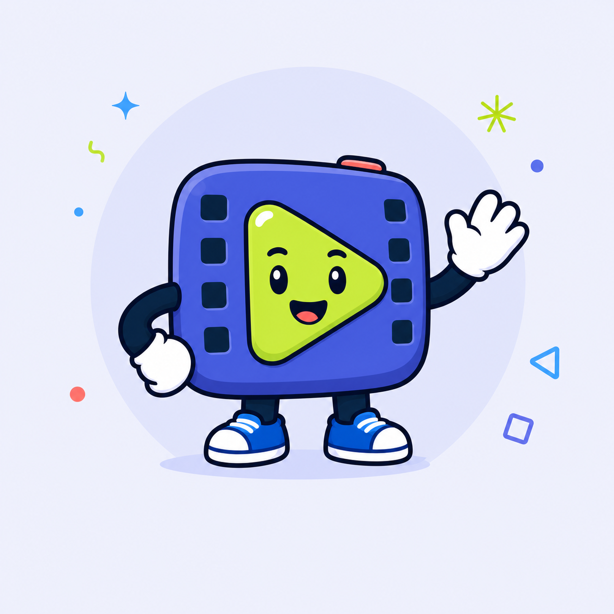

<a id="top"></a>

<h1 align="center"><strong>ClipQuest:</strong> turn lesson videos into learning quests</h1>

<p align="center">
  
</p>

<p align="center">
  <strong>Paste a YouTube or bilibili link, build an evidence-backed lesson, and learn it through immediate feedback.</strong>
</p>

<p align="center">
  <a href="https://clipquest.ccwu.cc"><strong>Open ClipQuest →</strong></a>
</p>

<p align="center">
  
  
  
  
  
</p>

<p align="center">
  <a href="#overview">Overview</a> ·
  <a href="#journey">Learning journey</a> ·
  <a href="#screenshots">Screenshots</a> ·
  <a href="#tech-stack">Tech stack</a> ·
  <a href="#architecture">Architecture</a> ·
  <a href="#quick-start">Quick start</a> ·
  <a href="#verification">Verification</a> ·
  <a href="#deploy">Deploy</a> ·
  <a href="#privacy">Privacy</a>
</p>

<p align="center">
  <strong>Project guides:</strong>
  <a href="./docs/HANDOFF-2026-08-04.md">Current handoff</a> ·
  <a href="./docs/duolingo-ui-research.md">UI research</a> ·
  <a href="./docs/QA-YOUTUBE-BROWSER-10X-2026-08-03.md">Browser QA</a>
</p>

---

<a id="overview"></a>

## 🧭 Product overview

ClipQuest turns public educational videos into focused learning sessions. A learner pastes a supported YouTube or bilibili URL, chooses multiple-choice, true/false, and/or short-answer questions, reviews the detected video, and starts a generated quest. ClipQuest checks fresh captions first and retains the complete accepted subtitle stream. If captions are unavailable, Whisper Tiny can transcribe transient audio on the learner's device before timestamped transcript text reaches the backend.

Transcript uploads carry a completeness manifest containing source and normalized segment counts, canonical character count, timing coverage, expected duration, and a text fingerprint. The server rejects a partial or changed upload. DeepSeek classification and every generation batch receive the complete accepted transcript, and every generated question must cite transcript evidence. The learner then completes a tactile, keyboard-accessible lesson; answers are validated by the server, and supported progress is saved for resume and later review.

```text
public YouTube / bilibili URL
              │
              ▼
 metadata + full-caption check
        ┌─────┴───────────┐
        │ captions        │ no captions
        ▼                 ▼
timestamped text   transient no-store audio stream
                           │
                           ▼
                 on-device decode + Whisper
        └─────────────┬─────────────┘
                      ▼
 complete-transcript question batches
                      │
                      ▼
       tactile lesson → feedback → review/mastery
```

> [!IMPORTANT]
> YouTube or Google account access is not required. ClipQuest begins with a public link, does not fetch watch history, and keeps its experimental YouTube device flow disabled by default. Private, deleted, geo-restricted, active-live, and otherwise unplayable sources fail explicitly instead of producing a quiz from partial text.

<p align="right"><a href="#top">↑ Back to top</a></p>

<a id="journey"></a>

## 🗺️ Learning journey

### 1. Paste first

The URL field is the primary action on desktop, tablet, and mobile. ClipQuest validates supported hosts, recognizes common YouTube URL forms, provides bilibili support, and gives actionable invalid, unsupported, private, or unavailable-video feedback.

### 2. Preview and prepare

The detected-video screen presents available title, creator, duration, language, platform, and thumbnail information before processing starts.

### 3. Acquire and prove the complete transcript

ClipQuest uses open-source YouTube.js plus a browser text provider to check fresh YouTube captions, and uses the native bilibili subtitle endpoint for bilibili. It parses every returned caption event without a first-segment or 12,000-segment slice. Oversized individual events are losslessly split, and extremely large or malformed responses are rejected rather than truncated. If no caption track is available, the existing transient `no-store` audio path decodes to 16 kHz mono PCM and runs WebGPU/WASM Whisper locally. Audio is never written to KV, R2, D1, Cache Storage, or application logs.

### 4. Generate an evidence-backed quest

Caption acquisition and long-session quiz pre-generation start as soon as a valid link is imported. The Cloudflare Worker validates the completeness manifest, stores the timestamped text privately, passes the complete transcript to concurrent DeepSeek batches of at most five questions, validates each response, and fills invalid or timed-out results with deterministic evidence-grounded questions. The learner's selected question types are enforced during generation and attempt creation.

### 5. Learn with immediate feedback

Large answer controls, a prominent progress bar, disabled/selected/correct/incorrect states, a lower feedback panel, and a clear Check → Continue rhythm keep each lesson focused. New quizzes use only multiple choice, true/false, and short answer; ordering questions are not generated or served.

> [!NOTE]
> Processing uses named stages rather than fabricated percentages. Retry, pause, cancellation, durable idempotency, and resume continue to use server-authoritative state.

<p align="right"><a href="#top">↑ Back to top</a></p>

<a id="screenshots"></a>

## 🖼️ Product screenshots

### Link-first home

The public-video field remains immediately visible and visually dominant. Saved ClipQuest lessons appear below it without turning the product into a video feed or account dashboard.


### Video detection and honest processing

| Detected video preview                                                                  | Staged lesson processing                                                        |
| --------------------------------------------------------------------------------------- | ------------------------------------------------------------------------------- |
|  |  |

### Lesson feedback

The lesson keeps the question readable while the lower action region changes state. Icons and text reinforce color so the result is understandable without relying on green or red alone.

| Correct answer                                                                              | Incorrect answer                                                                                |
| ------------------------------------------------------------------------------------------- | ----------------------------------------------------------------------------------------------- |
|  |  |

### Mobile learning and completion

| Paste a link                                                                     | Answer feedback                                                                   | Quest complete                                                                 |
| -------------------------------------------------------------------------------- | --------------------------------------------------------------------------------- | ------------------------------------------------------------------------------ |
|  |  |  |

> [!TIP]
> The same semantic tokens drive the fixed desktop learning rail, tablet composition, and safe-area-aware mobile bottom navigation. The mobile UI is not a scaled-down desktop layout.

<p align="right"><a href="#top">↑ Back to top</a></p>

<a id="tech-stack"></a>

## 🧩 Tech stack

| Layer                 | Technology                                                                    | Purpose                                                                                         |
| --------------------- | ----------------------------------------------------------------------------- | ----------------------------------------------------------------------------------------------- |
| Cross-platform client | Expo 57, Expo Router, React 19, React Native 0.86                             | Web, iOS, and Android routes from one application architecture                                  |
| Interface system      | React Native StyleSheet, semantic tokens, Fredoka, DM Sans, Expo Vector Icons | Responsive layouts, tactile states, accessible typography, and original ClipQuest presentation  |
| Edge API              | Cloudflare Workers, Queues, scheduled triggers                                | Authentication endpoints, source processing, generation jobs, retries, and reminders            |
| Data and assets       | D1, KV, private R2                                                            | Accounts, lessons, attempts, rate limits, complete transcript text, thumbnails, and model files |
| Authentication        | Better Auth                                                                   | Username/email sign-in, verification, recovery, and user-scoped data                            |
| AI and transcription  | DeepSeek, Transformers.js, WebGPU/WASM, `whisper.rn`                          | Evidence-backed question generation and private local speech recognition                        |
| Contracts             | TypeScript, Zod                                                               | Shared request/response schemas and generated-question validation                               |
| Quality               | Vitest, Playwright, ESLint, Prettier                                          | Unit/contract coverage, responsive browser journeys, linting, and formatting                    |
| Delivery              | Expo static export, Wrangler                                                  | Web assets and API deployed together through the ClipQuest Worker                               |

> [!NOTE]
> Fredoka and DM Sans are licensed Google Fonts. The ClipQuest explorer and interface assets are original; no Duolingo logo, mascot, proprietary font, illustration, or branded copy is included.

<p align="right"><a href="#top">↑ Back to top</a></p>

<a id="architecture"></a>

## 🔗 Architecture and module guide

### 1. [Expo application](./apps/app/)

The user-facing web and native application. Expo Router owns authentication, home, library, settings, video setup, processing, lesson, completion, and not-found routes. Shared components and semantic design tokens live under `apps/app/src`.

Best starting points: [routes](./apps/app/app/) · [components](./apps/app/src/components/) · [theme tokens](./apps/app/src/theme/tokens.ts)

### 2. [Cloudflare Worker API](./apps/api/)

The server boundary for Better Auth, source metadata, caption acquisition, private transcript persistence and verification, DeepSeek generation, answer validation, review scheduling, and static asset serving.

Best starting points: [Worker source](./apps/api/src/) · [Wrangler configuration](./apps/api/wrangler.jsonc) · [migrations](./apps/api/migrations/)

### 3. [Shared contracts](./packages/contracts/)

Zod schemas and TypeScript types shared by the Expo client and Worker. API assumptions and generated-question structures should change here before either consumer is updated.

### 4. [Local audio decoder](./modules/local-audio-decoder/)

The native bridge used to turn source media into Whisper-compatible PCM without sending raw audio to a transcription provider.

### 5. [Documentation and browser QA](./docs/)

The single [current handoff](./docs/HANDOFF-2026-08-04.md) records architecture, validation evidence, deployment state, and remaining risks. [Browser QA](./docs/QA-YOUTUBE-BROWSER-10X-2026-08-03.md) preserves the dated production run, while [Playwright journeys](./e2e/clipquest.spec.ts) cover the primary visual, responsive, validation, retry, feedback, completion, and operations states.

### 6. [Private operations console](./docs/ADMIN-CONSOLE.md)

Authorized operators use `/admin` to inspect system health, manage accounts and sessions, recover generation jobs, review lessons, and trace privileged actions. Roles are server-owned, every management API is permission checked, and privileged mutations are added to an audit log. The console never exposes Worker secrets, auth tokens, raw transcripts, answer keys, or password controls.

| Desktop overview                                                                           | Mobile people management                                                                   |
| ------------------------------------------------------------------------------------------ | ------------------------------------------------------------------------------------------ |
|  |  |

## Repository structure

```text
ClipQuest/
├─ apps/
│  ├─ app/                     # Expo Router client and static web export
│  └─ api/                     # Cloudflare Worker, bindings, and migrations
├─ packages/
│  └─ contracts/               # Shared Zod API and lesson schemas
├─ modules/
│  └─ local-audio-decoder/     # Native PCM decoding module
├─ e2e/                        # Playwright browser journeys
├─ docs/                       # Current handoff, research, QA notes, screenshots
└─ scripts/                    # Whisper model preparation and upload
```

<p align="right"><a href="#top">↑ Back to top</a></p>

<a id="quick-start"></a>

## 🚀 Quick start

Recommended: Node.js 22+, npm 10+, and a modern Chromium browser.

```bash
git clone https://github.com/UnoxyRich/ClipQuest.git
cd ClipQuest
npm ci
cp .dev.vars.example apps/api/.dev.vars
npm run db:migrate:local
```

Start the API and web client in separate terminals:

```bash
npm run dev:api
```

```bash
npm run dev:web
```

Open the local Expo URL shown in the second terminal. Use placeholder credentials for presentation-only UI work; real integrations require the following server-only values in `apps/api/.dev.vars`:

| Variable                             | Purpose                                                      |
| ------------------------------------ | ------------------------------------------------------------ |
| `DEEPSEEK_API_KEY`                   | Transcript-grounded classification and question generation   |
| `RESEND_API_KEY`                     | Verification and password-recovery email                     |
| `BETTER_AUTH_SECRET`                 | Better Auth signing and session security                     |
| `YOUTUBE_CREDENTIALS_ENCRYPTION_KEY` | Encryption for the disabled experimental YouTube device flow |

> [!WARNING]
> Never expose these values through `EXPO_PUBLIC_*`, screenshots, logs, issues, or commits. Local `.dev.vars` and production Worker secrets are separate.

<p align="right"><a href="#top">↑ Back to top</a></p>

<a id="verification"></a>

## 🛠️ Verification and builds

Run the complete repository quality gate:

```bash
npm run format:check
npm run lint
npm run typecheck
npm test
npm run test:e2e
npm run build
```

The 2026-08-04 full-subtitle implementation passes 66 Vitest tests: 33 API, 23 app, and 10 shared-contract tests. Regression coverage proves that a 12,005-event caption stream preserves its final event, exact completeness manifests reject changed or partial uploads, bilibili keeps every subtitle item, selected question types exclude ordering, and every DeepSeek generation batch receives the complete transcript. The existing Playwright journeys cover YouTube/bilibili link validation, processing retry, keyboard answer selection, feedback, completion, operations authorization/actions, horizontal overflow, and target desktop/tablet/mobile viewports.

Prepare native projects after native dependency changes:

```bash
npm run native:prebuild -w @clipquest/app
```

Create internal development builds:

```bash
npm run android:internal -w @clipquest/app
npm run ios:development -w @clipquest/app
```

Native Whisper requires a development build and does not run inside Expo Go. Real-device transcription, safe-area, and virtual-keyboard behavior should be included in release acceptance.

### Whisper model assets

Model weights are not bundled into the initial app. Pinned assets are downloaded, hashed, verified, and uploaded to private R2:

```bash
npm run models:prepare
npm run models:upload
```

<p align="right"><a href="#top">↑ Back to top</a></p>

<a id="deploy"></a>

## ☁️ Cloudflare deployment

The checked-in Wrangler configuration targets [clipquest.ccwu.cc](https://clipquest.ccwu.cc) and the provisioned D1, KV, private R2, Queue, scheduled trigger, and static-asset bindings.

Authenticate and enter production secrets interactively from the Worker workspace:

```bash
cd apps/api
npx wrangler login
npx wrangler whoami
npx wrangler secret put DEEPSEEK_API_KEY
npx wrangler secret put RESEND_API_KEY
npx wrangler secret put BETTER_AUTH_SECRET
npx wrangler secret put YOUTUBE_CREDENTIALS_ENCRYPTION_KEY
cd ../..
```

Apply migrations, build every workspace, and deploy:

```bash
npm run db:migrate:remote
npm run build
npm run cf:deploy
```

> [!NOTE]
> The app and Worker share one deployment. Apply migration `0008_question_types.sql`, then build the Expo export before deploying so `apps/app/dist` contains the intended static routes and assets.

> [!CAUTION]
> YouTube caption and audio acquisition uses open-source YouTube.js. Ordinary webpages cannot read YouTube audio cross-origin, so captionless audio is relayed transiently through the Worker with caching disabled. Smoke-test Cloudflare egress with supported public videos; never collect browser cookies or persist media.

<p align="right"><a href="#top">↑ Back to top</a></p>

<a id="privacy"></a>

## 🛡️ Privacy and security boundary

- Captionless YouTube audio is relayed through a short-lived user-bound `no-store` response, decoded in browser memory, and discarded after transcription. It is never persisted by ClipQuest.
- Only timestamped transcript segments—not raw audio—are uploaded for private storage and question generation. Accepted uploads must match their complete-transcript manifest exactly.
- DeepSeek and Resend credentials remain Worker-only and never enter Expo or web bundles.
- D1 queries and R2/KV objects are scoped to authenticated ClipQuest users and server-side authorization.
- Operations roles are stored server-side; learners receive no management permissions, operators cannot elevate roles, and owners are protected from self-lockout.
- Privileged account/job changes require a reason and write an audit record. Generic Better Auth admin endpoints are blocked so they cannot bypass ClipQuest auditing.
- Generated questions must pass shared schema, answer, selected-type, evidence, and transcript-segment validation. Complete-transcript generation requests are bounded to 60,000 normalized segments and 750,000 canonical characters; inputs over the safety envelope fail instead of being silently shortened.
- YouTube OAuth, watch-history imports, subscriptions, playlists, liked videos, and personalized account feeds are outside the core product and disabled.
- The experimental YouTube device connection remains behind `ENABLE_YOUTUBE_DEMO_HISTORY=false`; it is not required to create a quest.
- Do not commit `.env`, `.dev.vars`, credentials, private transcripts, model caches, or QA-user secrets.

> [!WARNING]
> Browser Playwright journeys use contract-shaped mocked API responses and never write production data. A green UI suite is not a substitute for live DeepSeek, Resend, source-provider, and real-device acceptance.

<p align="right"><a href="#top">↑ Back to top</a></p>

## License

ClipQuest is available under the [Apache License 2.0](./LICENSE).

<p align="right"><a href="#top">↑ Back to top</a></p>
